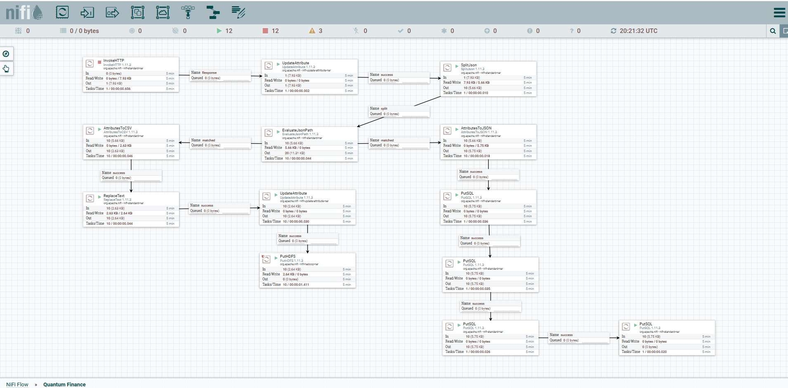

# Pipeline de Integração e Ingestão de Dados

Este repositório contém parte do pipeline de ingestão e integração de dados desenvolvido para a **Quantum Finance**, uma fintech fictícia criada como estudo de caso para a disciplina de **Arquitetura de Dados, Integração e Ingestão** do MBA em Ciência de Dados e Inteligência Artificial da FIAP.

---

## 📌 Objetivo

Implementar a etapa de ingestão de dados utilizando o **Apache NiFi**, conectando-se a uma API externa, realizando o tratamento dos dados recebidos e persistindo os resultados em sistemas de armazenamento estruturado, como banco de dados e HDFS.

---

## 🔄 Visão Geral do Pipeline

  

### Etapas implementadas:

1. **InvokeHTTP**  
   Conecta-se a uma API externa para obtenção de dados em formato JSON.

2. **SplitJson**  
   Separa o array JSON em objetos individuais.

3. **EvaluateJsonPath**  
   Extrai atributos específicos de cada objeto JSON.

4. **UpdateAttribute / AttributesToJSON**  
   Formata os atributos para persistência.

5. **PutSQL / PutHDFS**  
   Grava os dados em banco de dados relacional e HDFS, simulando uma arquitetura de *Data Lake*.

---

## 🏗️ Arquitetura de Dados

  

O projeto foi modelado seguindo a estrutura clássica de um **Data Lake**, conforme o diagrama apresentado no documento de arquitetura:

- Fontes de dados: APIs, arquivos, imagens.
- Camadas de armazenamento: **Raw**, **Harmonized**, **Curated**.
- Ferramentas: Apache NiFi, MySQL, HDFS.
- Consumo posterior por ferramentas analíticas e dashboards.

Veja o diagrama completo no arquivo [`Arquitetura de Dados - Quantum Finance.pdf`](Arquitetura%20de%20Dados%20-%20Quantum%20Finance.pdf).

---

## 🗃️ Base de Dados

O script de criação da base de dados está disponível no arquivo [`db_mysql_quantum_finance_clientes.sql`](db_mysql_quantum_finance_clientes.sql), contendo as seguintes tabelas:

- `Cliente`  
- `Contato`  
- `Documento`  

Essas tabelas representam entidades centrais da operação da fintech, e são abastecidas com dados extraídos e transformados via NiFi.

---

## 📜 Licença

Distribuído sob a licença [MIT](LICENSE) — sinta-se à vontade para usar, modificar e distribuir este projeto para fins acadêmicos ou pessoais.

---
